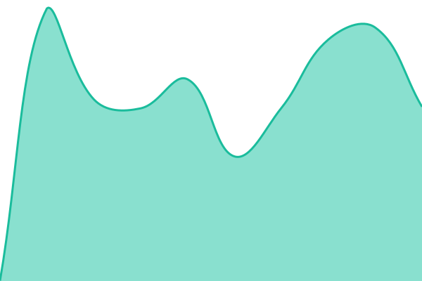

# [📈 Live Status](https://rcpch.github.io/digital-growth-charts-upptime): <!--live status--> **🟩 All systems operational**

This repository contains the open-source uptime monitor and status page for [The Royal College of Paediatrics and Child Health](https://rcpch.ac.uk), powered by [Upptime](https://github.com/upptime/upptime).

With [Upptime](https://upptime.js.org), you can get your own unlimited and free uptime monitor and status page, powered entirely by a GitHub repository. We use [Issues](https://github.com/rcpch/digital-growth-charts-upptime/issues) as incident reports, [Actions](https://github.com/rcpch/digital-growth-charts-upptime/actions) as uptime monitors, and [Pages](https://rcpch.github.io/digital-growth-charts-upptime) for the status page.

<!--start: status pages-->
<!-- This summary is generated by Upptime (https://github.com/upptime/upptime) -->
<!-- Do not edit this manually, your changes will be overwritten -->
<!-- prettier-ignore -->
| URL | Status | History | Response Time | Uptime |
| --- | ------ | ------- | ------------- | ------ |
|  [growth.rcpch.ac.uk](https://growth.rcpch.ac.uk) | 🟩 Up | [growth-rcpch-ac-uk.yml](https://github.com/rcpch/digital-growth-charts-upptime/commits/HEAD/history/growth-rcpch-ac-uk.yml) | 

 634ms
     
 | 

<a href="https://rcpch.github.io/digital-growth-charts-upptime/history/growth-rcpch-ac-uk">100.00%</a>
    

|  [api.rcpch.ac.uk (without Auth correctly returns 404)](https://api.rcpch.ac.uk/v1/growth) | 🟩 Up | [api-rcpch-ac-uk-without-auth-correctly-returns-404.yml](https://github.com/rcpch/digital-growth-charts-upptime/commits/HEAD/history/api-rcpch-ac-uk-without-auth-correctly-returns-404.yml) | 

 773ms
     
 | 

<a href="https://rcpch.github.io/digital-growth-charts-upptime/history/api-rcpch-ac-uk-without-auth-correctly-returns-404">100.00%</a>
    

|  [Growth API (UK WHO)](https://api.rcpch.ac.uk/growth/v1/uk-who/calculation) | 🟩 Up | [growth-api-uk-who.yml](https://github.com/rcpch/digital-growth-charts-upptime/commits/HEAD/history/growth-api-uk-who.yml) | 

 446ms
     
 | 

<a href="https://rcpch.github.io/digital-growth-charts-upptime/history/growth-api-uk-who">100.00%</a>
    

|  [forum.rcpch.tech](https://forum.rcpch.tech/) | 🟩 Up | [forum-rcpch-tech.yml](https://github.com/rcpch/digital-growth-charts-upptime/commits/HEAD/history/forum-rcpch-tech.yml) | 

 764ms
     
 | 

<a href="https://rcpch.github.io/digital-growth-charts-upptime/history/forum-rcpch-tech">100.00%</a>
    

|  [ollama](https://api.rcpch.ac.uk/ollama) | 🟩 Up | [ollama.yml](https://github.com/rcpch/digital-growth-charts-upptime/commits/HEAD/history/ollama.yml) | 

 449ms
     
 | 

<a href="https://rcpch.github.io/digital-growth-charts-upptime/history/ollama">100.00%</a>
    

|  [Census Platform](https://api.rcpch.ac.uk/deprivation/v2/index_of_multiple_deprivation_quantile?postcode=W1A1AA&year=2025&quantile=5) | 🟩 Up | [census-platform.yml](https://github.com/rcpch/digital-growth-charts-upptime/commits/HEAD/history/census-platform.yml) | 

 663ms
     
 | 

<a href="https://rcpch.github.io/digital-growth-charts-upptime/history/census-platform">100.00%</a>
    

|  [NHS Organisations](https://api.rcpch.ac.uk/nhs-organisations/v1/trusts/) | 🟩 Up | [nhs-organisations.yml](https://github.com/rcpch/digital-growth-charts-upptime/commits/HEAD/history/nhs-organisations.yml) | 

 778ms
     
 | 

<a href="https://rcpch.github.io/digital-growth-charts-upptime/history/nhs-organisations">100.00%</a>
    

|  [postcodes.io](https://api.rcpch.ac.uk/postcodes/postcodes/W1A1AA) | 🟩 Up | [postcodes-io.yml](https://github.com/rcpch/digital-growth-charts-upptime/commits/HEAD/history/postcodes-io.yml) | 

 432ms
     
 | 

<a href="https://rcpch.github.io/digital-growth-charts-upptime/history/postcodes-io">100.00%</a>
    

<!--end: status pages-->

[**Visit our status website →**](https://rcpch.github.io/digital-growth-charts-upptime)

## 📄 License

- Powered by: [Upptime](https://github.com/upptime/upptime)
- Code: [MIT](./LICENSE) © [The Royal College of Paediatrics and Child Health](https://rcpch.ac.uk)
- Data in the `./history` directory: [Open Database License](https://opendatacommons.org/licenses/odbl/1-0/)
